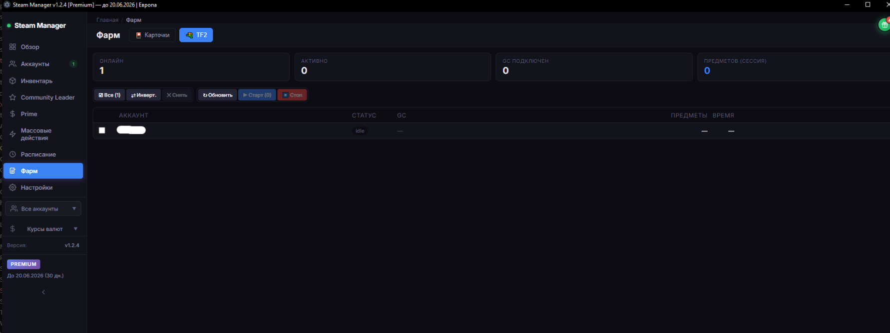

# Вкладка "Фарм"

## Страница «Фарм»

Автоматический фарм коллекционных карточек Steam и предметов TF2. Два режима работы: Карточки и TF2.

***

#### Переключатель режимов (вверху)

* 🃏 Карточки  — фарм карточек Steam через idle в играх
* ⚡ TF2 (скриншот 2) — фарм предметов TF2 через Game Coordinator

***

### Режим «Карточки»&#x20;

<figure><figcaption></figcaption></figure>

#### Статистика (верхние блоки)

Четыре информационных блока:

| Блок                  | Описание                                                            |
| --------------------- | ------------------------------------------------------------------- |
| Игр с карточками: 11  | Сколько игр в библиотеках аккаунтов имеют оставшиеся дропы карточек |
| Карточек остаётся: 38 | Общее количество карточек которые ещё можно выфармить               |
| Сфармлено (сессия): 1 | Сколько карточек выпало в текущей сессии                            |
| Активно: 0            | Количество аккаунтов которые сейчас фармят                          |
| Фарм / Авто-фарм: 0/0 | Количество запущенных фарм-сессий и авто-фарм аккаунтов             |

#### Фильтры и кнопки

* Выпадающий список — фильтр: `С карточками`, все, без карточек
* Поиск по логину — текстовое поле для поиска аккаунта
* Все (10) — выбрать все аккаунты
* ↻ Импорт — импортировать список аккаунтов
* × Снять — снять выделение со всех
* ↻ Обновить — обновить информацию о бейджах и оставшихся дропах
* ▶ Старт (0) (зелёная) — запустить фарм на выбранных аккаунтах
* ⏹ Стоп (красная) — остановить фарм

#### Таблица аккаунтов

| Столбец       | Описание                                                              |
| ------------- | --------------------------------------------------------------------- |
| ☐             | Чекбокс выбора аккаунта                                               |
| Аккаунт       | Логин аккаунта                                                        |
| Статус        | `offline` / `online` / `farming`                                      |
| Стратегия     | Стратегия фарма: `idle (off)` — idle выключен, или активная стратегия |
| Текущая игра  | Какая игра сейчас фармится ( `—` если не активен)                     |
| Игр           | Количество игр с оставшимися дропами                                  |
| Карт остаётся | Сколько карточек осталось выфармить                                   |
| Сфармлено     | Сколько карточек выпало в текущей сессии                              |
| Действия      | Кнопки управления для каждого аккаунта                                |

#### Кнопки действий (для каждого аккаунта)

* ▶ (зелёная) — запустить фарм на этом аккаунте
* ↻ — обновить информацию о бейджах
* 📋 — подробности (список игр, оставшиеся дропы)

***

### Режим «TF2» ()

Фарм предметов TF2 через подключение к Game Coordinator (GC).

<figure><figcaption></figcaption></figure>

#### Статистика (верхние блоки)

| Блок                  | Описание                                        |
| --------------------- | ----------------------------------------------- |
| Онлайн: 1             | Количество онлайн-аккаунтов                     |
| Активно: 0            | Сколько аккаунтов сейчас фармят TF2             |
| GC подключен: 0       | Сколько аккаунтов подключены к Game Coordinator |
| Предметов (сессия): 0 | Сколько предметов выпало за текущую сессию      |

#### Кнопки управления

* Все (1) — выбрать все аккаунты
* ↻ Импорт — импортировать аккаунты
* × Снять — снять выделение
* ↻ Обновить — обновить статусы GC и дропов
* ▶ Старт (0) (зелёная) — запустить TF2-фарм на выбранных аккаунтах
* ⏹ Стоп (красная) — остановить фарм

#### Таблица аккаунтов

| Столбец  | Описание                                                |
| -------- | ------------------------------------------------------- |
| Аккаунт  | Логин                                                   |
| Статус   | Статус: `idle` — ожидает, `farming` — фармит, `offline` |
| GC       | Статус подключения к Game Coordinator                   |
| Предметы | Количество полученных предметов                         |
| Время    | Сколько времени фармит                                  |

#### Как работает TF2 фарм

TF2 имеет еженедельный лимит дропов — 1-2 кейса в неделю
